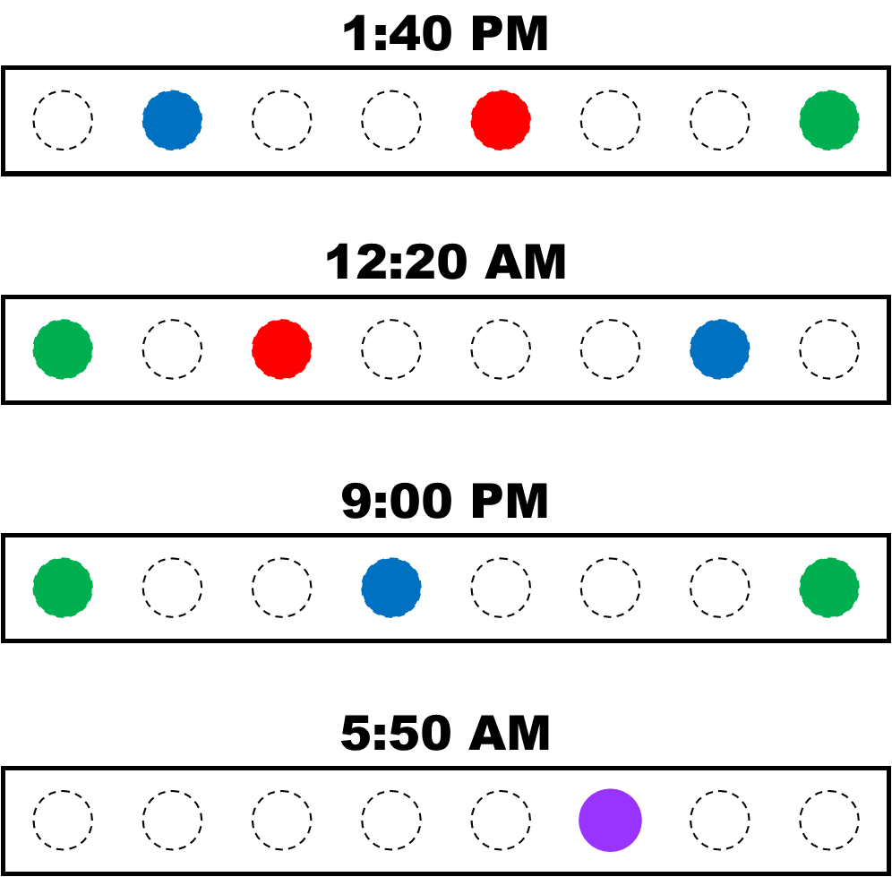

# Blinkt Clock
A clock using the Pimoroni Blinkt! 8-pixel LED strip for Raspberry Pi Zero W.

The clock uses all 8 pixels, indicates AM/PM, and is accurate to 10-minute increments. The first and last pixels are special function bits, while the inner 6 pixels keep the time.

## Pixel [0] - "Lo/Hi"

Indicates if the hour pixel is "lo" (1-6 inclusive) or "hi" (7-12 inclusive).

## Pixels [1:6] - "Time-keepers"

Indicates the hour (in blue) and the nearest 10-minute fraction of the hour (in red). If the hour and minute pixels overlap, they form a purple pixel.

For example,

    3:11 = ... [R] [_] [B] [_] [_] [_] ...

    6:47 = ... [_] [_] [_] [_] [R] [B] ...
    
    2:01 = ... [_] [B] [_] [_] [_] [_] ...

Because the clock relies on reading each pixel in relation to the entire strip, any unused time-keeper pixels are a very dim white at all times.

## Pixel [7] - "AM/PM"

Indicates AM or PM.

## Scheduling

Updates every 3 minutes. The resolution of the clock is low enough that this does not need to be run every minute.

    crontab -e
    */3 * * * * python blinkt_clock.py
    
## Examples

